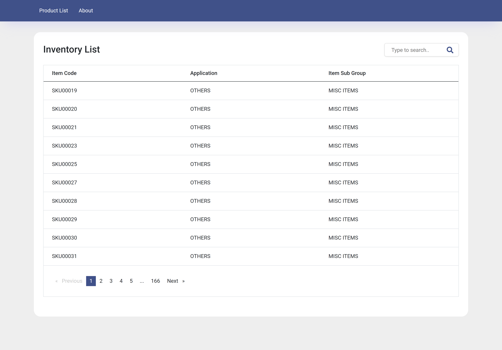
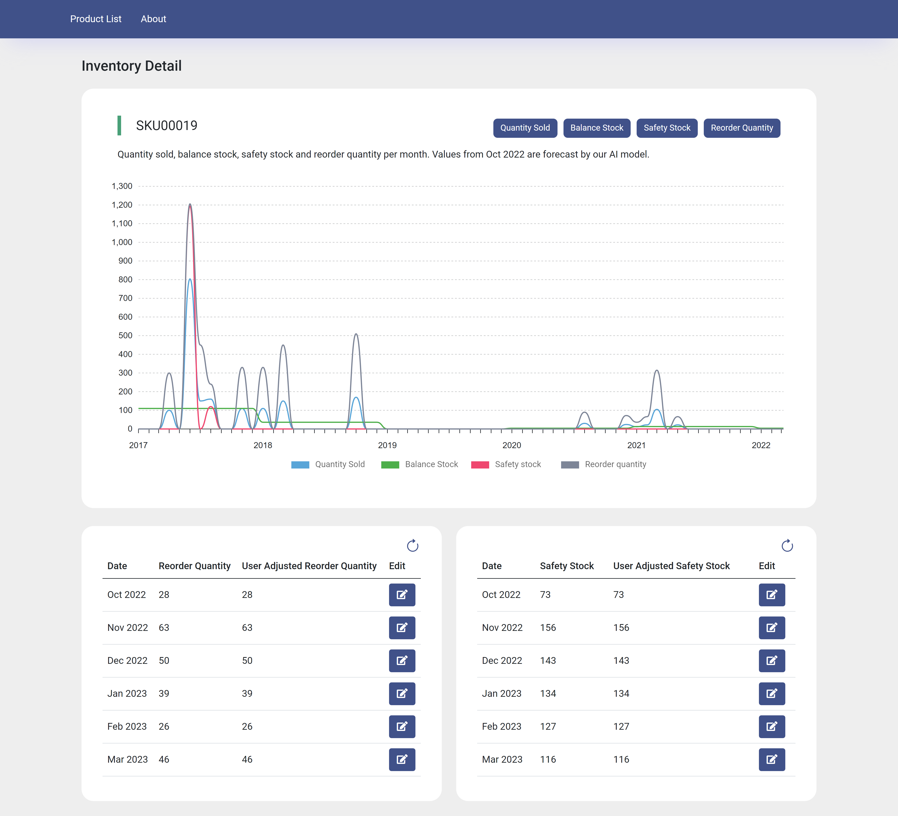

# Inventory Demand-Forecast Web App

## About the project

  

A web app to display the inventory demand for the next 6 months using Angular, D3.js and .NET Web Api Core.

## Tech Stack

This web app was built using Angular 14.2.6, D3.js, .NET Core Web Api with .NET 6.0 together with Entity Framework Core, and Microsoft SQL for the database.

## User Guide

The web app contains 2 buttons on the navigation menu, Product-List and About. Its main function is to allow the user to view the quantity sold, reorder quantity, safety stock and balance stock of each SKU for both past and forecast dates. It also allows the user to make adjustments to the reorder quantity and safety stock values predicted by our model if needed.
 

### Product list page

  

Here users can view the entire inventory of SKUs in a table pagination format and click on any table row to be redirected to the detail page for that particular SKU. They can also use the search bar at the top right to search for specific SKUs, and clicking on the search result will direct them to the detail page as well.
 

### Product detail page

  

At the top of this page is a multi-line chart showing the quantity sold, safety stock, reorder quantity and balance stock of that SKU. Users may also toggle which lines to hide/show using the filter buttons at the top right.
  Directly below this chart are two sections that allow the user to update the reorder quantity and safety stock values respectively. Clicking on the ‘Edit’ button brings up an input form that allows them to edit values. Should they wish to revert the values back to the values that our model predicted, they can do so by clicking the refresh icon on the top right of each section.

