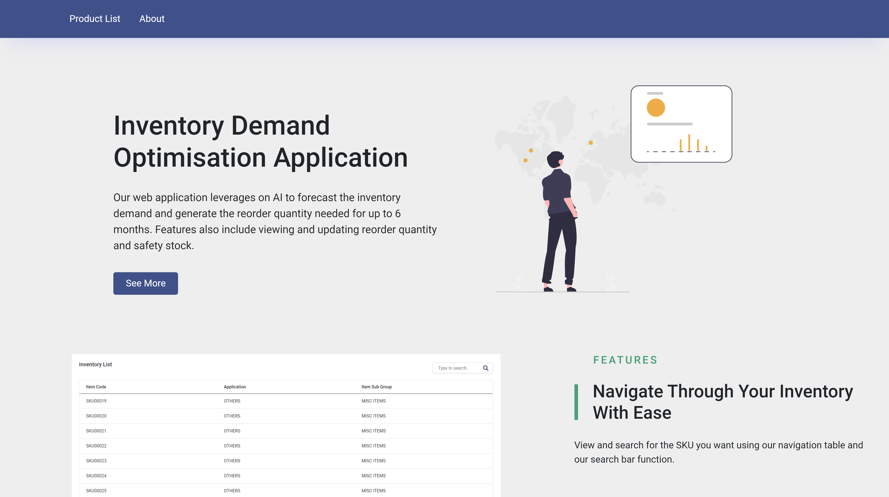

# Inventory Demand-Forecast Web App

## About the project

  

A web app to display the inventory demand for the next 6 months using Angular, D3.js and .NET Web Api Core.

## Tech Stack

This web app was built using Angular 14.2.6, D3.js, .NET Core Web Api with .NET 6.0 together with Entity Framework Core, and Microsoft SQL for the database.

## User Guide

The web app contains 2 buttons on the navigation menu, Product-List and About. Its main function is to allow the user to view the quantity sold, reorder quantity, safety stock and balance stock of each SKU for both past and forecast dates. It also allows the user to make adjustments to the reorder quantity and safety stock values predicted by our model if needed.
